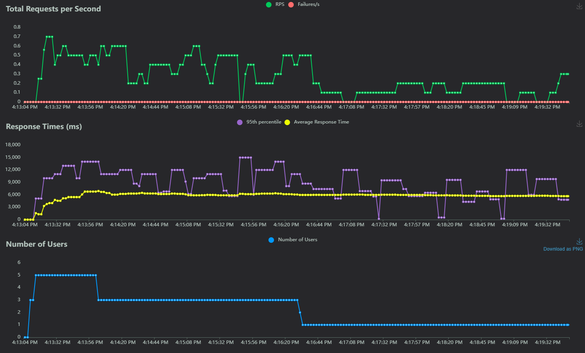

# How to Evaluate the System
To evaluate the system under different user loads, we provide a load testing tool based on the Locust package. This allows you to simulate multiple users interacting with the server and observe the system's performance.

### Installation

First, ensure all necessary dependencies are installed by running:
```
pip install -r requirements.txt
```
### Running the Load Test

To start the load test, use the following command:
```
locust -f locustfile.py --host=http://localhost:5000 --web-host=0.0.0.0
```
--host=http://localhost:5000: Specifies the server URL you want to test. Replace localhost:5000 with the actual host if the server is running elsewhere.
--web-host=0.0.0.0: Allows access to the Locust web interface from any network interface.
After running the command, open your browser and navigate to http://<your-server-ip>:8089. You will see the Locust web interface where you can configure the number of users and spawn rate to simulate different loads.
### Configuring Load

Number of Users: The total number of simulated users to spawn.
Spawn Rate: The rate at which users are added (e.g., 10 users per second).
Use the web interface to start the load test and monitor the system's performance under varying user loads


# Local benchmarking results and analyze:
Test Environment: The tests were conducted on a system with 2x Nvidia RTX 3090 GPUs.
Load Configuration: The server was tested with a maximum of 50 concurrent users, each sending requests with 5 different lengths.
Spawn Rate: Users were spawned at a rate of 1 user per second.
Wait Time: Each user waited between 1 to 3 seconds between requests.
Performance: Under this load, the average response time was approximately 2 to 3 seconds.
Analyze of Optimal Load: For optimal performance, the maximum response time should ideally be capped at 2 seconds (based on my user expectation). This level of performance is achievable with around 30 concurrent users under similar conditions.

